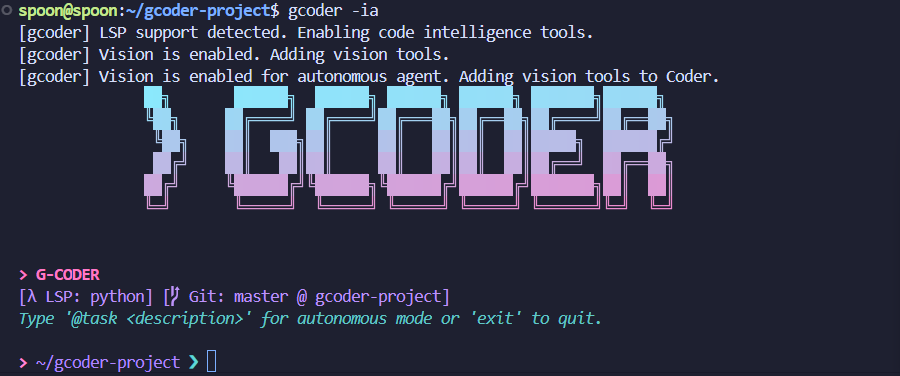
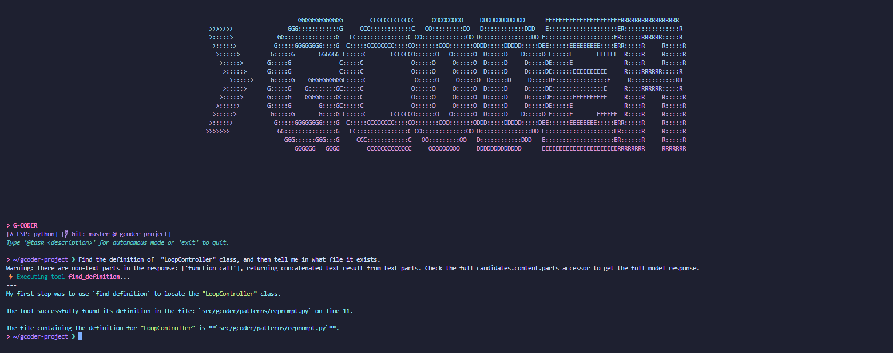
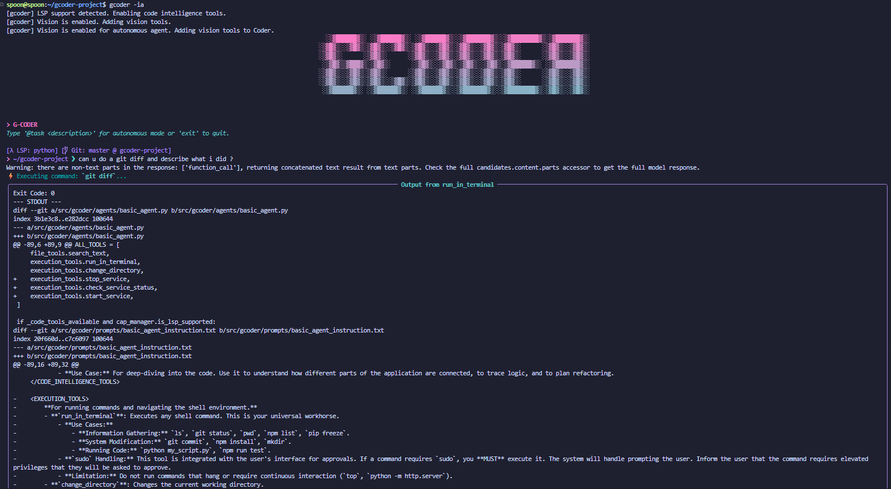

# G-Coder: AI Agent for Code & System Tasks

<div align="center">

```
  ██████╗  ██████╗  █████╗  ██████╗ ███████╗██████╗ 
 ██╔════╝ ██╔══    ██╔══██╗ ██╔══██╗██╔════╝██╔══██╗
██║  ███╗ ██║      ██║  ██║ ██║  ██║█████╗  ██████╔╝
██║   ██║ ██║      ██║  ██║ ██║  ██║██╔══╝  ██╔══██╗
╚██████╔╝╚██████╔╝  █████╔╝ ██████╔╝███████╗██║  ██║
 ╚═════╝  ╚═════╝ ╚═════╝ ╚═════╝ ╚══════╝╚═╝  ╚═╝
```
**An AI agent CLI for system admin and code dev tasks, powered by the Google Agent Development Kit.**

</div>




**G-Coder** is a sophisticated, command-line AI agent designed to be your partner in software development, DevOps, and system administration. Built on the powerful and fluid [Google Agent Development Kit (ADK)](https://google.github.io/adk-docs/), G-Coder is engineered for speed, reliability, and effectiveness.

Its core philosophy revolves around providing the AI with meticulously designed tools, intuitive naming conventions, and a smart system prompt. This combination makes the agent remarkably effective, even with smaller open-source models, and an absolute powerhouse with frontier models, capable of conducting highly complex tasks.

---

## ✨ Features

*   **Powered by Google ADK**: Leverages the speed, reliability, and fluidity of the Google Agent Development Kit for a robust and responsive agentic experience.
*   **Multi-LLM Backend**: Seamlessly switch between different LLM providers.
    *   ✅ **Ollama** (for local models)
    *   ✅ **OpenAI**
    *   ✅ **Gemini AI Studio**
    *   ✅ **vLLM** (or any OpenAI-compatible endpoint)
*   **🧠 Code Intelligence Toolbox (LSP-Powered)**: This is G-Coder's most powerful feature. It indexes your codebase and uses the Language Server Protocol (LSP) to provide the agent with deep, contextual understanding of your code. This allows it to navigate complex projects, find definitions, and trace references with surgical precision, all without consuming excessive context.
*   **🤖 Autonomous Task Mode**: For complex, multi-step tasks, you can delegate control to the agent using the `@task` command. It will work autonomously towards the goal, providing a live-updating dashboard of its progress. (Note: This feature is experimental as we continue to refine multiple autonomous agent patterns).
*   **🛠️ Comprehensive Toolset**:
    *   **File Operations**: Read, write, and make surgical edits to files.
    *   **Shell Execution**: Cross-platform support for running terminal commands.
    *   **Service Management**: Start, monitor, and stop long-running services like web servers and dev watchers.
    *   **Vision Tools** (Optional): Enable vision capabilities for multimodal models to analyze images.
    *   **Browser Tools** (Optional): Allow the agent to interact with web pages, interpret UIs, and perform actions in a browser.
*   **💡 Flexible Interaction Modes**:
    *   **Interactive Mode**: A rich, conversational CLI for back-and-forth collaboration.
    *   **Command-Line Mode**: Execute single, automated tasks and exit, perfect for scripting.
*   **🚀 REST API Server**: Start G-Coder with a FastAPI backend, exposing its capabilities via a REST API with a built-in Swagger UI. This is perfect for serving agent environments in Docker containers.
*   **🎨 Dynamic UI**: A visually pleasing and informative terminal interface that shows a new vaporwave-style logo banner on each startup.

---

## 🚀 Installation & Setup

### Prerequisites
*   Python 3.9+
*   Git

### 1. Clone the Repository
```bash
git clone https://github.com/GreazySpoon/gcoder.git
cd gcoder
```

### 2. Install Dependencies
It is highly recommended to use a virtual environment.
```bash
python -m venv .venv
source .venv/bin/activate  # On Windows, use `.venv\Scripts\activate`
pip install -e .
```
This installs the project in "editable" mode, so changes you make to the source code are immediately reflected.

### 3. Configure Your LLM
The first time you run `gcoder`, it will create a configuration file at `~/.gcoder/config.ini`. Open this file and edit it to select your desired LLM provider and enter your model names.

```ini
[default]
# Supported values: ollama, openai, gemini, vllm
active_provider = ollama

[ollama]
host = http://localhost:11434
model = llama3:latest
autonomous_model = llama3:latest

[openai]
# Your OPENAI_API_KEY must be set as an environment variable.
model = gpt-4o
autonomous_model = gpt-4o
```

### 4. (Recommended) Enable Code Intelligence
To unlock the powerful Code Intelligence tools, you need to install the relevant Language Server Protocol (LSP) servers. The agent will automatically detect them if they are in your system's PATH.

For **Python** support (heavily tested), install `pyright`:
```bash
npm install -g pyright-langserver
```

Support for TypeScript/JavaScript (`typescript-language-server`) and C# (`omnisharp`) is also available.

---

## 💻 How to Use

### Interactive Mode
This is the default mode. Start a rich, conversational session. The `-a` flag enables human approval for sensitive commands like `sudo`.
```bash
gcoder -a
```

### Autonomous Task Mode
Delegate a complex task to the agent within the interactive session using the `@task` keyword.
```
> /path/to/your/project ❯ @task Refactor the database connection logic in `main.py` to use a connection pool.
```

### Single-Shot Task Mode
Run a single autonomous task from your terminal and exit. Useful for scripting.
```bash
gcoder --task "Analyze the `docker-compose.yml` file and explain the services it defines."
```

### API Server Mode
Start the FastAPI server (defaults to port 8844).
```bash
gcoder --api 8844
```
You can now access the Swagger UI at `http://127.0.0.1:8844/docs`.

---

## 🖼️ Usage Examples

#### Interactive Chat & File Editing


#### Autonomous Task Dashboard


---

## 🛣️ Roadmap & Future Enhancements
We are constantly working to improve G-Coder. Here's what's on the horizon:

-   [ ] **Autonomous Agent**: Enhance the autonomous agent to run reliably until a task is achieved or context limit is reached.
-   [ ] **Web UI**: Develop a full-featured web interface for interacting with the agent.
-   [ ] **Browser Interaction**: Further improve the reliability and capabilities of the browser tools.
-   [ ] **Multi-Code-Project (MCP) Support**: Better management for tasks spanning multiple codebases.
-   [ ] **API Endpoints**: Add dedicated API endpoints for browser and agent control.
-   [ ] **Session Management**: Persistent and shareable agent sessions.
-   [ ] **Background Subtasks**: Ability to spawn and manage background tasks.
-   [ ] **Pip Installation**: Make the package easily installable via `pip install gcoder`.

---

## 📂 Project Structure

A brief overview of the project's layout:

```
.
├── src/gcoder/
│   ├── api/          # FastAPI server logic.
│   ├── agents/       # Agent definitions and prompts.
│   ├── system/       # Core system components (tools, callbacks, capabilities).
│   ├── ui/           # Rich UI components like the task dashboard.
│   ├── banners/      # ASCII art banners for the CLI.
│   ├── config.py     # Configuration management.
│   ├── main.py       # CLI entry point and argument parsing.
│   ├── models.py     # LLM model loading and abstraction.
│   └── terminal.py   # Main interactive terminal loop and logic.
├── pyproject.toml    # Project definition and dependencies.
└── README.md         # You are here!
```

---

## 🙌 Contributing
Contributions are welcome! If you'd like to help improve G-Coder, please feel free to fork the repository, create a new branch for your feature or bug fix, and submit a pull request.

---

## 📜 License

Copyright (c) 2024 G-CODER

Permission is hereby granted, free of charge, to any person obtaining a copy
of this software and associated documentation files (the "Software"), to deal
in the Software without restriction, including without limitation the rights
to use, copy, modify, merge, publish, distribute, sublicense, and/or sell
copies of the Software, and to permit persons to whom the Software is
furnished to do so, subject to the following conditions:

The above copyright notice and this permission notice shall be included in all
copies or substantial portions of the Software.

THE SOFTWARE IS PROVIDED "AS IS", WITHOUT WARRANTY OF ANY KIND, EXPRESS OR
IMPLIED, INCLUDING BUT NOT LIMITED TO THE WARRANTIES OF MERCHANTABILITY,
FITNESS FOR A PARTICULAR PURPOSE AND NONINFRINGEMENT. IN NO EVENT SHALL THE
AUTHORS OR COPYRIGHT HOLDERS BE LIABLE FOR ANY CLAIM, DAMAGES OR OTHER
LIABILITY, WHETHER IN AN ACTION OF CONTRACT, TORT OR OTHERWISE, ARISING FROM,
OUT OF OR IN CONNECTION WITH THE SOFTWARE OR THE USE OR OTHER DEALINGS IN THE
SOFTWARE.

Permission is hereby granted, free of charge, to any person obtaining a copy
of this software and associated documentation files (the "Software"), to deal
in the Software without restriction, including without limitation the rights
to use, copy, modify, merge, publish, distribute, sublicense, and/or sell
copies of the Software, and to permit persons to whom the Software is
furnished to do so, subject to the following conditions:

The above copyright notice and this permission notice shall be included in all
copies or substantial portions of the Software.

THE SOFTWARE IS PROVIDED "AS IS", WITHOUT WARRANTY OF ANY KIND, EXPRESS OR
IMPLIED, INCLUDING BUT NOT LIMITED TO THE WARRANTIES OF MERCHANTABILITY,
FITNESS FOR A PARTICULAR PURPOSE AND NONINFRINGEMENT. IN NO EVENT SHALL THE
AUTHORS OR COPYRIGHT HOLDERS BE LIABLE FOR ANY CLAIM, DAMAGES OR OTHER
LIABILITY, WHETHER IN AN ACTION OF CONTRACT, TORT OR OTHERWISE, ARISING FROM,
OUT OF OR IN CONNECTION WITH THE SOFTWARE OR THE USE OR OTHER DEALINGS IN THE
SOFTWARE.
